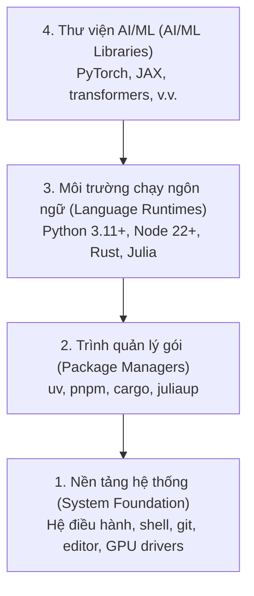

# Môi trường phát triển (Dev Environment)

> Công cụ định hình tư duy của bạn. Hãy thiết lập chúng một lần và thiết lập sao cho đúng chuẩn.

**Loại bài học:** Xây dựng (Build)  
**Ngôn ngữ:** Python, Node.js, Rust  
**Điều kiện tiên quyết:** Không có  
**Thời gian hoàn thành:** ~45 phút  

## Mục tiêu học tập

- Thiết lập chuỗi công cụ (toolchains) cho Python 3.11+, Node.js 20+ và Rust từ sơ khai (scratch)
- Cấu hình môi trường ảo (virtual environments) và các trình quản lý gói (package managers) để đảm bảo bản dựng tái lập (reproducible builds)
- Xác minh quyền truy cập GPU với CUDA/MPS và chạy thử nghiệm một phép toán tensor
- Hiểu kiến trúc lớp 4 tầng: nền tảng hệ thống, gói thư viện, môi trường chạy (runtimes), và thư viện AI

## Vấn đề

Bạn chuẩn bị bắt đầu hành trình nghiên cứu kỹ thuật AI (AI engineering) thông qua hơn 200 bài học thực hành bằng Python, TypeScript, Rust và Julia. Nếu môi trường của bạn gặp lỗi, mỗi bài học sẽ biến thành một cuộc chiến chống lại các vấn đề về công cụ thay vì tập trung học tập.

Hầu hết mọi người bỏ qua bước thiết lập môi trường. Để rồi sau đó họ phải dành hàng giờ liền để sửa lỗi nhập thư viện (import errors), xung đột phiên bản (version conflicts) và thiếu driver CUDA. Chúng ta sẽ làm việc này một lần, bài bản và đúng chuẩn.

## Khái niệm

Một môi trường kỹ thuật AI có cấu trúc gồm 4 tầng:



Chúng ta sẽ cài đặt từ dưới lên. Mỗi tầng phụ thuộc chặt chẽ vào tầng ngay bên dưới nó.

## Xây dựng

### Bước 1: Nền tảng hệ thống (System Foundation)

Kiểm tra hệ thống của bạn và tiến hành cài đặt các công cụ cơ bản.

```bash
# macOS
xcode-select --install
brew install git curl wget

# Ubuntu/Debian
sudo apt update && sudo apt install -y build-essential git curl wget

# Windows (Khuyên dùng WSL2)
wsl --install -d Ubuntu-24.04
```

### Bước 2: Cài đặt Python với trình quản lý uv

Chúng ta sử dụng `uv` — trình quản lý gói nhanh hơn pip từ 10 đến 100 lần và tự động xử lý các môi trường ảo (virtual environments).

```bash
curl -LsSf https://astral.sh/uv/install.sh | sh

uv python install 3.12

uv venv
source .venv/bin/activate  # Hoặc dùng .venv\Scripts\activate trên Windows
```

Sau đó cài đặt các thư viện cơ bản:
```bash
uv pip install numpy matplotlib jupyter
```

Kiểm tra xác minh:

```python
import sys
print(f"Phiên bản Python: {sys.version}")

import numpy as np
print(f"Phiên bản NumPy: {np.__version__}")
a = np.array([1, 2, 3])
print(f"Véc-tơ: {a}, tích vô hướng với chính nó: {np.dot(a, a)}")
```

### Bước 3: Cài đặt Node.js với pnpm

Dành cho các bài học liên quan đến TypeScript (các tác tử - Agents, giao thức MCP servers, ứng dụng web).

```bash
curl -fsSL https://fnm.vercel.app/install | bash
fnm install 22
fnm use 22

npm install -g pnpm

node -e "console.log('Node version:', process.version)"
```

### Bước 4: Cài đặt Rust

Dành cho các bài học đòi hỏi hiệu năng tối đa (bộ suy luận - inference, hạ tầng hệ thống).

```bash
curl --proto '=https' --tlsv1.2 -sSf https://sh.rustup.rs | sh

rustc --version
cargo --version
```

### Bước 5: Cài đặt Julia (Không bắt buộc)

Dành cho các bài học nặng về toán học phức tạp mà Julia hỗ trợ xuất sắc.

```bash
curl -fsSL https://install.julialang.org | sh

julia -e 'println("Julia version: ", VERSION)'
```

### Bước 6: Thiết lập GPU (Nếu máy tính của bạn có hỗ trợ)

```bash
# NVIDIA GPU
nvidia-smi

# Cài đặt PyTorch hỗ trợ CUDA
uv pip install torch torchvision torchaudio --index-url https://download.pytorch.org/whl/cu124
```

```python
import torch
print(f"Hỗ trợ CUDA khả dụng: {torch.cuda.is_available()}")
if torch.cuda.is_available():
    print(f"Tên GPU: {torch.cuda.get_device_name(0)}")
```

Nếu không có GPU thì sao? Không sao cả. Hầu hết các bài học đều có thể chạy mượt mà trên CPU. Đối với những bài học huấn luyện mô hình lớn (training-heavy), bạn có thể sử dụng Google Colab hoặc các dịch vụ GPU đám mây.

### Bước 7: Xác minh tất cả

Chạy tập lệnh xác minh môi trường đã được xây dựng sẵn:

```bash
python phases/00-setup-and-tooling/01-dev-environment/code/verify.py
```

## Sử dụng

Môi trường phát triển của bạn hiện đã hoàn toàn sẵn sàng cho tất cả các bài học trong khóa học. Dưới đây là phân loại chi tiết công cụ sử dụng:

| Ngôn ngữ | Lĩnh vực áp dụng | Trình quản lý gói |
|----------|------------------|-------------------|
| Python | Giai đoạn 1-12 (ML, DL, NLP, Thị giác máy tính, Âm thanh, LLMs) | uv |
| TypeScript | Giai đoạn 13-17 (Công cụ, Tác tử - Agents, Swarms, Hạ tầng) | pnpm |
| Rust | Giai đoạn 12, 15-17 (Hệ thống tối ưu hóa hiệu năng) | cargo |
| Julia | Giai đoạn 1 (Nền tảng toán học máy học) | Pkg |

## Sản phẩm

Bài học này cung cấp một kịch bản kiểm tra tự động mà bất kỳ ai cũng có thể chạy để chẩn đoán hệ thống.

Xem tệp [outputs/prompt-env-check.md](file:///e:/ThanhTai/DHSP_HK2_25_26/ai_from_scratch/ai-engineering-from-scratch/phases/00-setup-and-tooling/01-dev-environment/outputs/prompt-env-check.md) để lấy cấu trúc prompt giúp trợ lý AI chẩn đoán và khắc phục nhanh các lỗi môi trường phát triển của bạn.

## Bài tập

1. Chạy tập lệnh xác minh môi trường phát triển cục bộ và giải quyết mọi lỗi hiển thị (nếu có).
2. Tạo một môi trường ảo Python chuyên biệt cho khóa học này và tiến hành cài đặt PyTorch.
3. Viết chương trình "Hello World" bằng cả 4 ngôn ngữ và chạy kiểm tra thành công trên thiết bị của bạn.
