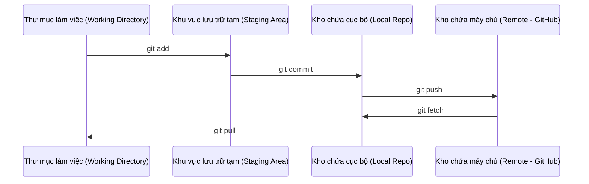

# Git & Hợp tác (Git & Collaboration)

> Quản lý phiên bản không phải là một tùy chọn phụ. Mọi thử nghiệm, mọi mô hình và mọi bài học bạn xây dựng ở đây đều phải được theo dõi chặt chẽ.

**Loại bài học:** Tìm hiểu (Learn)  
**Ngôn ngữ:** --  
**Điều kiện tiên quyết:** Giai đoạn 0, Bài 01  
**Thời gian hoàn thành:** ~30 phút  

## Mục tiêu học tập

- Cấu hình thông tin tài khoản git (identity) và sử dụng thành thạo quy trình làm việc hàng ngày bao gồm: add, commit và push
- Tạo và hợp nhất (merge) các nhánh (branches) để tiến hành các thử nghiệm cô lập mà không làm ảnh hưởng đến nhánh chính (`main`)
- Thiết lập tệp `.gitignore` giúp loại trừ các tệp checkpoint của mô hình và các tệp nhị phân có dung lượng lớn
- Duyệt tìm lịch sử cam kết thông qua `git log` để nắm bắt sự phát triển của dự án

## Vấn đề

Bạn chuẩn bị viết hàng trăm tệp mã nguồn trên khắp 20 giai đoạn. Nếu không có hệ thống quản lý phiên bản (version control), bạn sẽ dễ dàng làm mất mã nguồn, gây ra những lỗi nghiêm trọng không thể khôi phục, và không thể cộng tác với người khác một cách trơn tru.

Git là công cụ giải quyết vấn đề đó. GitHub là nơi mã nguồn của bạn được lưu trữ trực tuyến. Bài học này sẽ trang bị cho bạn chính xác những kiến thức Git cần thiết cho khóa học này, tinh gọn và không rườm rà.

## Khái niệm



Ba nguyên tắc vàng cần ghi nhớ:
1. Lưu tiến độ thường xuyên (`git commit`)
2. Đẩy mã nguồn lên máy chủ để sao lưu (`git push`)
3. Tạo nhánh riêng khi thực hiện các thử nghiệm (`git checkout -b experiment`)

## Xây dựng

### Bước 1: Cấu hình git toàn cục

```bash
git config --global user.name "Tên Của Bạn"
git config --global user.email "email_cua_ban@example.com"
```

### Bước 2: Quy trình làm việc hàng ngày

```bash
git status
git add file.py
git commit -m "Add perceptron implementation"
git push origin main
```

### Bước 3: Tạo nhánh riêng cho thử nghiệm mới

```bash
git checkout -b experiment/new-optimizer

# ... thực hiện thay đổi mã nguồn, commit tiến độ ...

git checkout main
git merge experiment/new-optimizer
```

### Bước 4: Làm việc với kho chứa khóa học này

```bash
git clone https://github.com/DuongThanhTaii/ai_from_scratch.git
cd ai_from_scratch

git checkout -b my-progress
# Tiến hành học tập và viết mã nguồn, lưu tiến độ (commit)
git push origin my-progress
```

## Sử dụng

Trong suốt khóa học này, bạn sẽ sử dụng chính xác các lệnh sau:

| Lệnh | Trường hợp sử dụng |
|---------|------|
| `git clone` | Tải kho chứa bài học về máy tính |
| `git add` + `git commit` | Lưu trữ tiến độ làm việc của bạn |
| `git push` | Sao lưu mã nguồn của bạn lên đám mây GitHub |
| `git checkout -b` | Thử nghiệm các ý tưởng mới mà không lo làm hỏng mã nguồn chính |
| `git log --oneline` | Xem nhanh tóm tắt các lịch sử thay đổi đã lưu |

Chỉ đơn giản như vậy. Bạn không cần phải lo lắng về các kỹ thuật nâng cao như rebase, cherry-pick hay submodules để bắt đầu học tập.

## Bài tập

1. Thực hiện clone kho chứa này, tạo một nhánh mới tên là `my-progress`, viết một tệp bất kỳ, commit và đẩy nó lên kho chứa từ xa (GitHub) của bạn.
2. Tạo một tệp `.gitignore` chuẩn ở thư mục gốc giúp tự động loại bỏ các tệp mô hình lớn (`.pt`, `.pth`, `.safetensors`).
3. Đọc và duyệt qua lịch sử cam kết của kho chứa này bằng lệnh `git log --oneline` để xem cách khóa học được phát triển qua các giai đoạn.

## Thuật ngữ cốt lõi

| Thuật ngữ | Mọi người thường nói | Thực tế có nghĩa là |
|------|----------------|----------------------|
| Commit | "Lưu tệp" | Một bản chụp (snapshot) toàn bộ dự án tại một thời điểm nhất định |
| Nhánh (Branch) | "Bản sao" | Một con trỏ trỏ tới cam kết (commit) cụ thể và tự động di chuyển tiếp khi bạn viết mã nguồn |
| Hợp nhất (Merge) | "Gộp code" | Lấy những thay đổi từ một nhánh và áp dụng chúng vào một nhánh khác |
| Máy chủ (Remote) | "Đám mây" | Một bản sao của kho chứa dự án được lưu trữ ở máy chủ trực tuyến (như GitHub, GitLab) |
