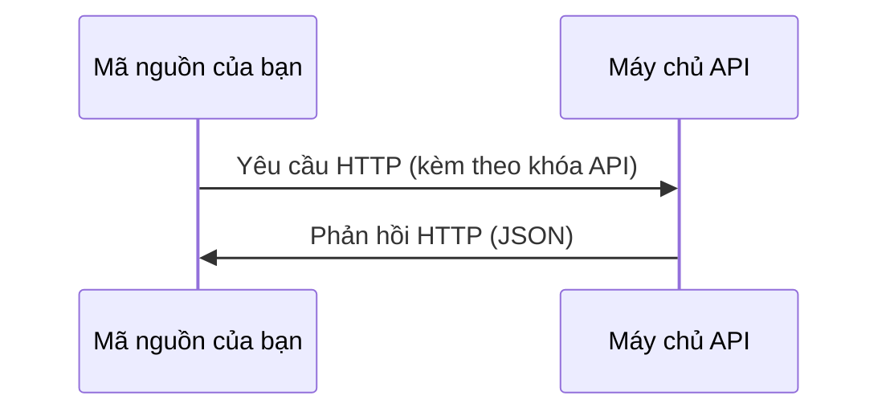

# API & Khóa truy cập (API Keys)

> Mọi API của các hệ thống AI đều hoạt động theo cùng một cách: gửi yêu cầu, nhận phản hồi. Các chi tiết có thể thay đổi, nhưng mô hình hoạt động thì không.

**Thể loại:** Xây dựng (Build)
**Ngôn ngữ:** Python, TypeScript
**Điều kiện tiên quyết:** Giai đoạn 0, Bài học 01
**Thời gian:** ~30 phút

## Mục tiêu học tập

- Lưu trữ các khóa truy cập API một cách an toàn bằng cách sử dụng các biến môi trường và tệp `.env`
- Thực hiện cuộc gọi API LLM bằng cả SDK Python của Anthropic và giao thức HTTP thô
- So sánh định dạng yêu cầu/phản hồi giữa cách dùng SDK và HTTP thô phục vụ cho việc gỡ lỗi
- Nhận diện và xử lý các lỗi API phổ biến bao gồm lỗi xác thực và giới hạn tần suất (rate limits)

## Vấn đề thực tế

Bắt đầu từ Giai đoạn 11, bạn sẽ thực hiện gọi các API LLM (Anthropic, OpenAI, Google). Trong Giai đoạn 13-16, bạn sẽ xây dựng các tác tử sử dụng các API này trong các vòng lặp. Bạn cần biết cách hoạt động của các khóa API, cách lưu trữ chúng an toàn, và cách thực hiện cuộc gọi API đầu tiên của mình.

## Khái niệm cốt lõi



Mỗi cuộc gọi API đều có:
1. Một điểm cuối (URL Endpoint)
2. Một khóa API (Xác thực tài khoản)
3. Thân yêu cầu (Những gì bạn muốn gửi đi)
4. Thân phản hồi (Những gì bạn nhận lại được)

## Thực hiện nó (Build It)

### Bước 1: Lưu trữ khóa API an toàn

Tuyệt đối không đưa trực tiếp khóa API vào mã nguồn của bạn. Hãy sử dụng các biến môi trường.

```bash
export ANTHROPIC_API_KEY="sk-ant-..."
export OPENAI_API_KEY="sk-..."
```

Hoặc sử dụng tệp cấu hình `.env` (hãy nhớ thêm tệp này vào `.gitignore`):

```
ANTHROPIC_API_KEY=sk-ant-...
OPENAI_API_KEY=sk-...
```

### Bước 2: Cuộc gọi API đầu tiên (Python)

```python
import anthropic

client = anthropic.Anthropic()

response = client.messages.create(
    model="claude-sonnet-4-20250514",
    max_tokens=256,
    messages=[{"role": "user", "content": "What is a neural network in one sentence?"}]
)

print(response.content[0].text)
```

### Bước 3: Cuộc gọi API đầu tiên (TypeScript)

```typescript
import Anthropic from "@anthropic-ai/sdk";

const client = new Anthropic();

const response = await client.messages.create({
  model: "claude-sonnet-4-20250514",
  max_tokens: 256,
  messages: [{ role: "user", content: "What is a neural network in one sentence?" }],
});

console.log(response.content[0].text);
```

### Bước 4: Gọi HTTP thô (Không dùng SDK)

```python
import os
import urllib.request
import json

url = "https://api.anthropic.com/v1/messages"
headers = {
    "Content-Type": "application/json",
    "x-api-key": os.environ["ANTHROPIC_API_KEY"],
    "anthropic-version": "2023-06-01",
}
body = json.dumps({
    "model": "claude-sonnet-4-20250514",
    "max_tokens": 256,
    "messages": [{"role": "user", "content": "What is a neural network in one sentence?"}],
}).encode()

req = urllib.request.Request(url, data=body, headers=headers, method="POST")
with urllib.request.urlopen(req) as resp:
    result = json.loads(resp.read())
    print(result["content"][0]["text"])
```

Đây chính là những gì SDK thực thi bên dưới. Việc hiểu rõ cách thực hiện cuộc gọi HTTP thô giúp ích rất nhiều cho bạn khi gỡ lỗi hệ thống.

## Vận dụng nó (Use It)

Đối với khóa học này:

| API | Khi nào bạn cần đến | Gói miễn phí |
|-----|--------------------|--------------|
| Anthropic (Claude) | Giai đoạn 11-16 (tác tử, công cụ) | Tặng $5 credit khi đăng ký |
| OpenAI | Giai đoạn 11 (so sánh mô hình) | Tặng $5 credit khi đăng ký |
| Hugging Face | Giai đoạn 4-10 (mô hình, tập dữ liệu) | Miễn phí hoàn toàn |

Bạn chưa cần phải đăng ký toàn bộ các API này ngay lập tức. Hãy thiết lập chúng khi bài học yêu cầu.

## Sản phẩm (Ship It)

Bài học này tạo ra sản phẩm:
- `outputs/prompt-api-troubleshooter.md` - chẩn đoán và khắc phục nhanh các lỗi API phổ biến

## Bài tập

1. Lấy một khóa API từ Anthropic và thực hiện cuộc gọi API đầu tiên của bạn
2. Thử nghiệm phiên bản gọi HTTP thô và so sánh định dạng phản hồi với phiên bản dùng SDK
3. Thử cố ý sử dụng một khóa API bị sai để đọc hiểu thông báo lỗi trả về

## Các thuật ngữ chính

| Thuật ngữ | Người ta thường nói gì | Ý nghĩa thực tế |
|-----------|------------------------|-----------------|
| Khóa API (API Key) | "Mật khẩu cho API" | Một chuỗi văn bản duy nhất để xác định tài khoản của bạn và cho phép thực thi các yêu cầu gửi đi |
| Giới hạn tần suất (Rate limit) | "Họ đang bóp băng thông của tôi" | Số lượng yêu cầu tối đa trên mỗi phút/giờ để ngăn ngừa lạm dụng và đảm bảo tính công bằng của hệ thống |
| Từ tố (Token) | "Một từ" (trong ngữ cảnh API) | Đơn vị thanh toán: các từ tố đầu vào (input tokens) và đầu ra (output tokens) được tính toán và tính phí riêng biệt |
| Truyền phát (Streaming) | "Phản hồi thời gian thực" | Nhận phản hồi theo từng từ thay vì phải chờ đợi toàn bộ câu trả lời hoàn tất |
